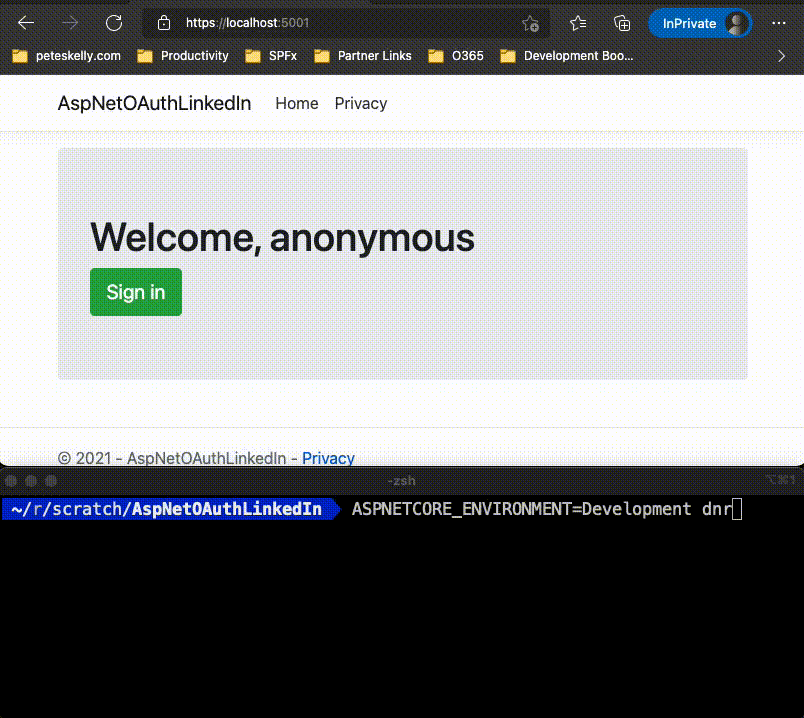

# AspNetOAuthLinkedIn
Authenticating LinkedIn Users Using ASPNET-Contrib OAuth Providers

## Companion Code to Blog Post 

See [Authenticating LinkedIn Users Using ASPNET-Contrib OAuth Providers](https://peteskelly.com/authenticating-linkedin-users-using-asp-net-contrib-oauth-providers/) on my [blog](https://peteskelly.com). 

